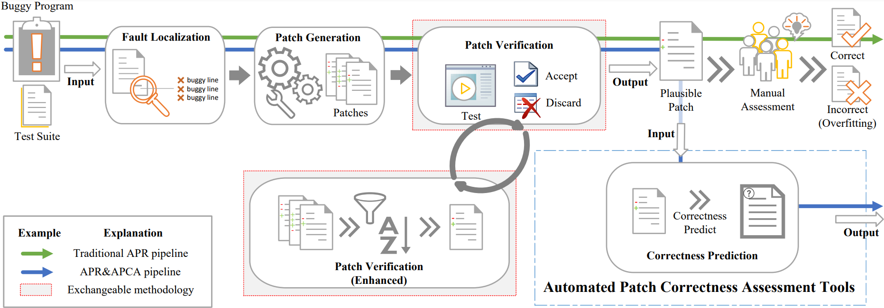

# Patch Correctness Assessment: A Survey

## Procedure of Automated Program Repair

## Collected Papers

#### Patch Correctness Assessment with Oracle

| **Paper Title**                                              | **Venue** | **Year** | **Code/Data Available**                                      |
| ------------------------------------------------------------ | --------- | -------- | ------------------------------------------------------------ |
| [Identifying test-suite-overfitted patches through test case generation](https://dl.acm.org/doi/10.1145/3092703.3092718) | ISSTA     | 2017     | [Yes](https://github.com/qixin5/DiffTGen)                    |
| [Automated patch assessment for program repair at scale](https://link.springer.com/article/10.1007/s10664-020-09920-w) | ESE       | 2021     | [Yes](https://anonymous.4open.science/r/cffe573f-61ab-4d99-9e7c-dc769d657e75/) |
| [Invalidator: Automated Patch Correctness Assessment Via Semantic and Syntactic Reasoning](https://ieeexplore.ieee.org/abstract/document/10066209) | TSE       | 2023     | [Yes](https://github.com/thanhlecongg/Invalidator)           |

#### Patch Correctness Assessment without Oracle

##### Dynamic Methods

###### Methods Using Runtime Information

| **Paper Title**                                              | **Venue** | **Year** | **Code/Data Available**                                      |
| ------------------------------------------------------------ | --------- | -------- | ------------------------------------------------------------ |
| [Test-based Patch Clustering for Automatically-Generated Patches Assessment](https://arxiv.org/abs/2207.11082) | Arxiv     | 2022     | [Yes](https://anonymous.4open.science/r/xTestCluster-1803/)  |
| [Identifying patch correctness in test-based program repair](https://dl.acm.org/doi/abs/10.1145/3180155.3180182) | ICSE      | 2018     | [Yes](https://github.com/Ultimanecat/DefectRepairing)        |
| [ObjSim: lightweight automatic patch prioritization via object similarity](https://dl.acm.org/doi/abs/10.1145/3395363.3404362) | ISSTA     | 2020     | Yes, [[1]](https://bit.ly/2K8gnYV) and [[2]](http://bit.ly/2I3aMBU) |
| [Crex: Predicting patch correctness in automated repair of C programs through transfer learning of execution semantics](https://www.sciencedirect.com/science/article/abs/pii/S0950584922001562) | IST       | 2022     | [Yes](https://github.com/1993ryan/crex)                      |

###### Methods Using Test Case Argument

| **Paper Title**                                              | **Venue** | **Year** | **Code/Data Available**                                      |
| ------------------------------------------------------------ | --------- | -------- | ------------------------------------------------------------ |
| [Alleviating patch overfitting with automatic test generation: a study of feasibility and effectiveness for the Nopol repair system](https://link.springer.com/article/10.1007/s10664-018-9619-4) | ESE       | 2019     | [Yes](https://github.com/Spirals-Team/test4repair-experiments) |
| [Better test cases for better automated program repair](https://dl.acm.org/doi/abs/10.1145/3106237.3106274) | ESEC/FSE  | 2017     | [Yes](http://asset.uwaterloo.ca/tests4repair)                |
| [Test Case Generation for Program Repair: A Study of Feasibility and Effectiveness](https://arxiv.org/abs/1703.00198) | Arxiv     | 2017     | No                                                           |
| [More Reliable Test Suites for Dynamic APR by using Counterexamples](https://ieeexplore.ieee.org/document/9700327) | ISSRE     | 2021     | [Yes](https://github.com/Amirfarhad-Nilizadeh/CounterexamplesJava-JML) |

###### Methods Using Hybrid Technology

| **Paper Title**                                              | **Venue** | **Year** | **Code/Data Available**                           |
| ------------------------------------------------------------ | --------- | -------- | ------------------------------------------------- |
| [Patch correctness assessment in automated program repair based on the impact of patches on production and test code](https://dl.acm.org/doi/abs/10.1145/3533767.3534368) | ISSTA     | 2022     | [Yes](https://github.com/ali-ghanbari/shibboleth) |
| [Shibboleth: Hybrid Patch Correctness Assessment in Automated Program Repair](https://dl.acm.org/doi/abs/10.1145/3551349.3559519) | ASE       | 2023     | [Yes](https://github.com/ali-ghanbari/shibboleth) |

##### Static Methods

###### Methods Using Code Intent

| **Paper Title**                                              | **Venue**   | **Year** | **Code/Data Available**                                 |
| ------------------------------------------------------------ | ----------- | -------- | ------------------------------------------------------- |
| [Identifying Incorrect Patches in Program Repair Based on Meaning of Source Code](https://ieeexplore.ieee.org/abstract/document/9690887) | IEEE Access | 2022     | [Yes](https://github.com/ngocpq/MIPI)                   |
| [Is this Change the Answer to that Problem?: Correlating Descriptions of Bug and Code Changes for Evaluating Patch Correctness](https://dl.acm.org/doi/abs/10.1145/3551349.3556914) | ASE         | 2022     | [Yes](https://github.com/Trustworthy-Software/Quatrain) |

###### Methods Using Human Feedback

| **Paper Title**                                              | **Venue** | **Year** | **Code/Data Available**                          |
| ------------------------------------------------------------ | --------- | -------- | ------------------------------------------------ |
| [Interactive Patch Filtering as Debugging Aid](https://ieeexplore.ieee.org/document/9609108) | ICSME     | 2021     | [Yes](https://github.com/Emilyaxe/InPaFer-ICSME) |
| [Poracle: Testing Patches Under Preservation Conditions to Combat the Overfitting Problem of Program Repair](https://dl.acm.org/doi/10.1145/3625293) | TOSEM     | 2023     | [Yes](https://github.com/UNIST-LOFT/poracle)     |

###### Methods Using Manual Crafted Features

| **Paper Title**                                              | **Venue** | **Year** | **Code/Data Available**                                     |
| ------------------------------------------------------------ | --------- | -------- | ----------------------------------------------------------- |
| [Anti-patterns in search-based program repair](https://dl.acm.org/doi/abs/10.1145/2950290.2950295) | FSE       | 2016     | [Yes](https://anti-patterns.github.io/search-based-repair/) |
| [Automated Classification of Overfitting Patches With Statically Extracted Code Features](https://ieeexplore.ieee.org/abstract/document/9399306) | TSE       | 2021     | [Yes](https://github.com/ASSERT-KTH/ODSExperiment)          |

###### Methods Using Auto Learned Features

| **Paper Title**                                              | **Venue** | **Year** | **Code/Data Available**                                |
| ------------------------------------------------------------ | --------- | -------- | ------------------------------------------------------ |
| [Context-Aware Code Change Embedding for Better Patch Correctness Assessment](https://dl.acm.org/doi/abs/10.1145/3505247) | TOSEM     | 2022     | [Yes](https://github.com/Ringbo/Cache)                 |
| [Predicting Patch Correctness Based on the Similarity of Failing Test Cases](https://dl.acm.org/doi/full/10.1145/3511096) | TOSEM     | 2022     | [Yes](https://github.com/HaoyeTianCoder/BATS)          |
| [Utilizing Source Code Embeddings to Identify Correct Patches](https://ieeexplore.ieee.org/abstract/document/9034714) | IBF       | 2020     | No                                                     |
| [Evaluating representation learning of code changes for predicting patch correctness in program repair](https://dl.acm.org/doi/abs/10.1145/3324884.3416532) | ASE       | 2020     | [Yes](https://github.com/TruX-DTF/DL4PatchCorrectness) |
| [The Best of Both Worlds: Combining Learned Embeddings with Engineered Features for Accurate Prediction of Correct Patches](https://dl.acm.org/doi/full/10.1145/3576039) | TOSEM     | 2023     | [Yes](https://github.com/HaoyeTianCoder/Panther)       |
| [PatchZero: Zero-Shot Automatic Patch Correctness Assessment](https://arxiv.org/abs/2303.00202) | Arxiv     | 2023     | No                                                     |
| [Boosting Automated Patch Correctness Prediction via Pre-trained Language Model](https://arxiv.org/abs/2301.12453) | Arxiv     | 2023     | No                                                     |

###### Methods Using Original Programs as a Partial Specification

| **Paper Title**                                              | **Venue** | **Year** | **Code/Data Available**                        |
| ------------------------------------------------------------ | --------- | -------- | ---------------------------------------------- |
| [Quality Evaluation Method of Automatic Software Repair Using Syntax Distance Metrics](https://www.mdpi.com/2073-8994/14/8/1751) | Symmetry  | 2022     | No                                             |
| [Priority Measurement of Patches for Program Repair Based on Semantic Distance](https://www.mdpi.com/2073-8994/12/12/2102) | Symmetry  | 2020     | [Yes](https://github.com/wls860707495/Dataset) |

###### Methods Using Naturalness

| **Paper Title**                                              | **Venue** | **Year** | **Code/Data Available** |
| ------------------------------------------------------------ | --------- | -------- | ----------------------- |
| [Language models can prioritize patches for practical program patching](https://dl.acm.org/doi/abs/10.1145/3524459.3527343) | APR       | 2022     | No                      |

| **Paper Title**                                              | **Venue** | **Year** | **Code/Data Available**                                   |
| ------------------------------------------------------------ | --------- | -------- | --------------------------------------------------------- |
| [A Method to Identify Overfitting Program Repair Patches Based on Expression Tree](https://papers.ssrn.com/sol3/papers.cfm?abstract_id=4476243) | SSRN      | 2023     | No                                                        |
| [Learning to Represent Patches](https://arxiv.org/abs/2308.16586) | Arxiv     | 2023     | [Yes](https://anonymous.4open.science/r/Patcherizer-1E04) |

#### Empircal study

| **Paper Title**                                              | **Venue** | **Year** | **Code/Data Available**                                      |
| ------------------------------------------------------------ | --------- | -------- | ------------------------------------------------------------ |
| [Exploring Plausible Patches Using Source Code Embeddings in JavaScript](https://ieeexplore.ieee.org/abstract/document/9474540) | APR       | 2021     | [Yes](https://github.com/AAI-USZ/JS-patch-exploration-APR2021) |
| [Attention: Not Just Another Dataset for Patch-Correctness Checking](https://arxiv.org/abs/2207.06590) | Arxiv     | 2023     | [Yes](https://github.com/claudeyj/patch_correctness)         |
| [How Different Is It Between Machine-Generated and Developer-Provided Patches? : An Empirical Study on the Correct Patches Generated by Automated Program Repair Techniques](https://ieeexplore.ieee.org/document/8870172) | ESEM      | 2019     | [Yes](https://github.com/Kaka727/correct_patch_analysis )    |
| [Overfitting in semantics-based automated program repair](https://clairelegoues.com/papers/ese18overfit.pdf) | ESE       | 2018     | Yes, [[1]](https://doi.org/10.5281/zenodo.1012686) and [[2]](https://goo.gl/4BwK3s) |
| [On Reliability of Patch Correctness Assessment](https://ieeexplore.ieee.org/document/8812054) | ICSE      | 2019     | [Yes](https://github.com/ anonymousICSE2019/patchcorrectness) |
| [On the efficiency of test suite based program repair: A Systematic Assessment of 16 Automated Repair Systems for Java Programs](https://dl.acm.org/doi/abs/10.1145/3377811.3380338) | ICSE      | 2020     | [Yes](https://github.com/TruX-DTF/APR-Efficiency)            |
| [Exploring True Test Overfitting in Dynamic Automated Program Repair using Formal Methods](https://ieeexplore.ieee.org/document/9438573) | ICST      | 2021     | [Yes](https://github.com/Amirfarhad- Nilizadeh/Java-JML) |
| [Some Automatically Generated Patches are More Likely to be Correct than Others: An Analysis of Defects4J Patch Features](https://ieeexplore.ieee.org/document/9809084) | APR       | 2022     | [Yes]( https://github.com/IncorrectDefects/ReplicationPackage) |
| [Is the Cure Worse than the Disease? Overfitting in Automated Program Repair](https://dl.acm.org/doi/10.1145/2786805.2786825) | ESEC/FSE  | 2015     | [Yes](https://repairbenchmarks.cs.umass.edu/)                |
| [Revisiting Object Similarity-Based Patch Ranking in Automated Program Repair: An Extensive Study](https://ieeexplore.ieee.org/document/9809091) | APR       | 2022     | [Yes](https://bit.ly/35Y5QOg)                                |
| [Automated Patch Correctness Assessment: How Far are We?](https://ieeexplore.ieee.org/document/9286063) | ASE       | 2020     | [Yes](https://zenodo.org/record/3730599)                     |
